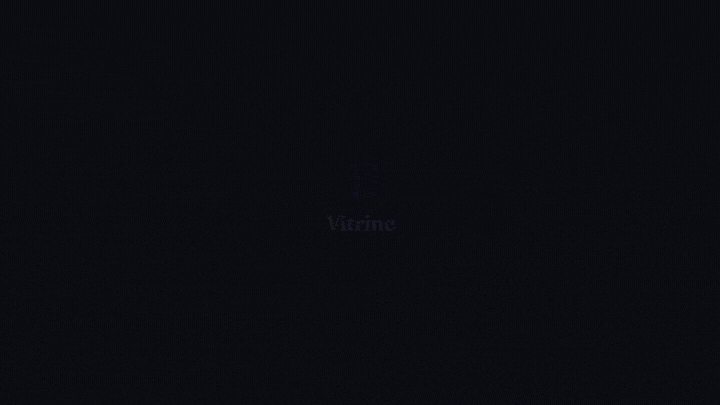

<h1 align="center">Vitrine</h1>

<p align="center">
  Record a real product demo from any repository, as a polished MP4 and README-ready GIF.
</p>

<p align="center">
  <a href="https://www.npmjs.com/package/vitrine-skill">
    
  </a>
  <a href="https://github.com/rhyumiranda/vitrine/blob/main/LICENSE">
    
  </a>
  <a href="https://nodejs.org/">
    
  </a>
</p>

<p align="center">
  
</p>

Vitrine is an agent skill that studies a repository, chooses a short real workflow, drives the running product, and records it. The pixels in the demo belong to the product you built. Vitrine only adds the outer camera, framing, cursor motion, and optional branded bookends.

It supports two paths:

<table>
  <tr>
    <td width="50%" align="center">
      <br>
      <sub><b>CLI</b> - a typed, animated terminal running the real command.</sub>
    </td>
    <td width="50%" align="center">
      <br>
      <sub><b>Web</b> - a real browser session with cinematic held zoom and cursor motion.</sub>
    </td>
  </tr>
</table>

## Start here

**You need:** Node.js 18+, `ffmpeg`, and `gifsicle`. CLI demos also need Docker; web demos need the Playwright Chromium download.

Install Vitrine for all your agents:

```sh
npx skills add rhyumiranda/vitrine --skill vitrine -g
```

For just the current project:

```sh
npx skills add rhyumiranda/vitrine --skill vitrine --project
```

`skills add` installs the skill files only. On its first demo, Vitrine checks the runtime, explains any needed package install and Chromium download, and asks before proceeding. Install system packages separately; on macOS:

```sh
brew install ffmpeg gifsicle
docker pull ghcr.io/charmbracelet/vhs  # needed for CLI demos
```

Then open Claude Code in the repository you want to show and ask:

```text
record a demo of this project
```

Vitrine detects whether the project is a CLI or web app, proposes a 15-30 second storyline, asks before any build or mutating command, then writes an MP4 and optimized GIF from the real run.

## What makes a Vitrine demo different

| Ordinary recording | Vitrine |
| --- | --- |
| A manual take that drifts from the product | Real commands and the real running UI |
| A flat terminal capture | Typed commands, streamed output, and intentional pacing |
| A raw web capture | Held zoom between nearby clicks and a human-like follow cursor |
| A mockup or edited stand-in | The product's existing design system and data flow |
| A one-off artifact | A code-defined workflow you can record again after a release |

Vitrine is for software product demos, README GIFs, launch clips, and landing-page loops. It is not a general desktop recorder or a narrated explainer-video tool.

## The workflow

```text
detect repository -> understand real behavior -> propose storyline -> confirm -> capture -> compose -> optimize
```

1. **Detect**: reads manifests and the README to identify a CLI, web app, or unknown project.
2. **Understand**: checks actual help output, routes, and entry points before writing a story.
3. **Propose**: creates a short `steps.json` based on real actions.
4. **Confirm**: shows the storyline and asks before builds, installs, writes, or other side effects.
5. **Capture**: records either a VHS terminal session or a Playwright browser session.
6. **Compose**: adds optional intro/outro and the cinematic web camera through Remotion.
7. **Optimize**: creates a small GIF alongside the MP4.

The skill uses the repository as the source of truth. It does not redraw, restyle, or fake the app being demonstrated.

## What gets generated

| File | Purpose |
| --- | --- |
| `steps.json` | The real actions and waits that make up the story. |
| `brand.json` | Optional title, logo, and call-to-action bookends. |
| `demo.mp4` | The high-quality product demo. |
| `demo.gif` | A GIF optimized for a README or issue. |

See [steps-schema.md](references/steps-schema.md), [brand.json](examples/brand.json), and the [examples](examples/) for the exact formats.

## Run the pipeline yourself

The skill is the recommended interface. These commands are useful when authoring or debugging a demo locally:

```sh
# Read only: classify the repository and collect likely entry points.
python3 scripts/detect.py . > project.json

# Verify which dependencies each path needs.
bash scripts/check_deps.sh all
```

For a CLI demo, create a story and render it through VHS:

```sh
python3 scripts/render_tape.py steps.json project.json > demo.tape
docker run --rm -v "$PWD":/vhs -w /vhs ghcr.io/charmbracelet/vhs demo.tape
```

For a web demo, capture the real browser session and compose it:

```sh
node scripts/capture_web.mjs steps.json out
node compositor/render.mjs out/raw.webm out/events.json demo.mp4 --brand brand.json
```

Optimize an MP4 for README use:

```sh
bash scripts/optimize.sh demo.mp4 demo.gif
```

## Safety

Vitrine may run project code to show the product working. Its intended operating model is conservative:

- Capture and rendering run in Docker on a copy of the target repository where practical.
- Read-only commands can be inspected automatically; builds, installs, writes, and other side effects require confirmation.
- Every capture action and wait has a timeout.
- If a web app needs authentication or production data, provide a seeded test account or a safe route. Vitrine does not invent credentials.

## Project map

| Path | Responsibility |
| --- | --- |
| [SKILL.md](SKILL.md) | Agent workflow, safety rules, and decisions. |
| `scripts/detect.py` | Read-only project detection. |
| `scripts/render_tape.py` | `steps.json` to VHS tape for CLI demos. |
| `scripts/capture_web.mjs` | Playwright capture and click/timing events for web demos. |
| `compositor/` | Remotion intro/outro and web camera composition. |
| `scripts/optimize.sh` | MP4 to optimized GIF conversion. |
| `references/` | Detailed formats and rendering notes. |

## Development

```sh
npm pack --dry-run
bash scripts/check_deps.sh all
```

Use the demo fixtures in `demo/` to exercise the CLI and web paths without another repository.

## License

[MIT](LICENSE) Copyright 2026 Rhyu Miranda
