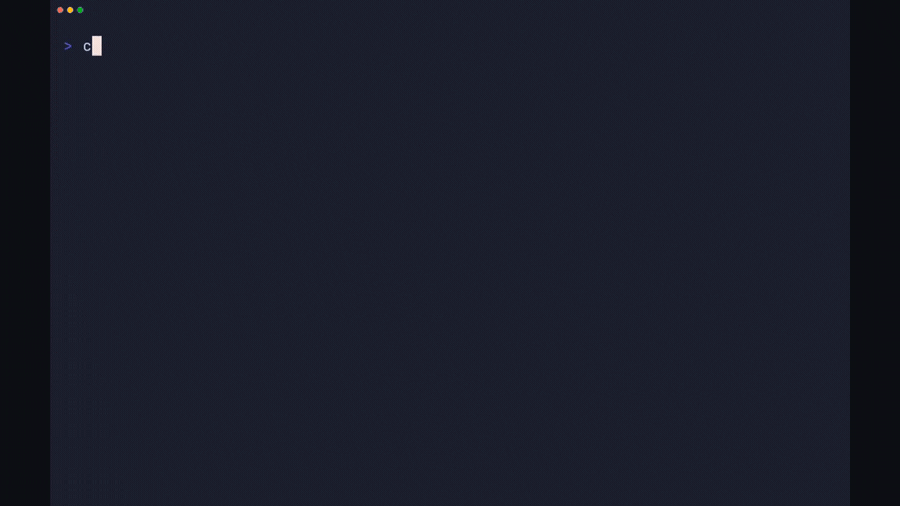
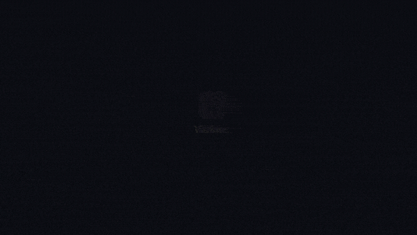

# 🪟 Vitrine

**Point it at a project. Get back a demo of the real thing actually being used.**

<table>
  <tr>
    <td width="50%" align="center">
      <br>
      <sub><b>CLI path</b> — real terminal, real output</sub>
    </td>
    <td width="50%" align="center">
      <br>
      <sub><b>Web path</b> — cinematic zoom-on-click</sub>
    </td>
  </tr>
</table>

<sub>Both clips were produced by Vitrine itself — logo/CTA bookends added by the compositor; everything between is the real product.</sub>

Vitrine analyzes a repo, figures out how the product is actually used, then *drives the real running product* and records it — a real animated terminal for CLIs, a cinematic zoom-on-click video for web apps. The UI in the output is the genuine product, its own design system, exactly as shipped. Nothing is mocked.

MIT-licensed. Local-first. Built on [`vhs`](https://github.com/charmbracelet/vhs), [Playwright](https://playwright.dev), [Remotion](https://remotion.dev), and Claude Code.

---

## What is Vitrine?

A demo-video generator that runs *above* your project. You point it at a repo; it detects whether the project is a CLI or a web app, infers a short, believable usage story, performs those steps against the real product, and records an animated demo — `demo.mp4` for marketing plus an optimized `demo.gif` for your README. Optional animated intro (logo/title) and outro (title + CTA) bookend the result.

The name is French for a shop window — the display case that shows your product working behind glass.

## The problem

Making a good product demo is manual, fiddly work:

- You screen-record yourself, fluff a take, and re-record. Again.
- The "demo" drifts from the product — a mockup, a slide, a stale GIF.
- Terminal casts are static or badly paced; web recordings look flat with no focus.
- Every release, the demo is out of date and nobody wants to redo it.

The product is right there and working. Capturing *that*, well, is the annoying part.

## The solution

Vitrine takes the recording off your plate:

- **It uses the real product.** The pixels in the demo are the genuine UI — its own design system, running live. No mocks, no restyling.
- **It figures out the steps.** It reads manifests, `--help`, and the README to infer a compelling 15–30s happy path for *this* repo.
- **It's animated, with real timing.** Terminal: characters type out, commands run, output streams, deliberate pauses. Web: the camera eases into each click and the cursor glides between targets (the Screen Studio / Recordly look) — all generated as code, headless.
- **It's branded.** Optional animated intro logo/title and outro CTA, as timed bookends.
- **It's safe.** Capture and render run inside Docker on a copy of the repo; only read-only commands auto-run, and it asks before anything that builds, installs, or mutates state.
- **It's two formats.** A sharp MP4 for anywhere that takes video, and a size-optimized GIF for READMEs.

## Why now?

Three things line up:

1. **Agents can read a repo** and infer how it's meant to be used — the "what should the demo show" step that used to need a human.
2. **Terminal-as-code (VHS) and video-as-code (Remotion)** make deterministic, repeatable, headless renders possible — no fragile screen capture, no GUI app in the loop.
3. **Headless Chromium + Playwright** can drive a real web app with no display server, so the whole pipeline runs in a container.

The missing piece was a lean layer that ties inference to rendering. That's Vitrine.

## Before & after

| | Before | With Vitrine |
|---|---|---|
| **Source of truth** | mockup / slide / stale GIF | the real product, running live |
| **Effort** | record, re-record, edit | one command (or "record a demo") |
| **Terminal demo** | static or badly paced | typed out, real output, real timing |
| **Web demo** | flat screen capture | cinematic zoom-on-click + eased cursor |
| **Branding** | added by hand in an editor | animated intro/outro as code |
| **Staying current** | manual redo each release | re-run; it re-derives the steps |

## Where to use it

- **Any git repo** — a CLI tool or a web app.
- **README GIFs, launch videos, changelog clips, landing-page loops.**
- **Docker available** for safe, dependency-bundled capture + render.
- Works across all your projects: install once, run per repo.

Not built for: recording arbitrary desktop apps, or narrated explainer videos (it shows the product, it doesn't talk over it).

## How to use it

**Prereqs:** [Docker](https://www.docker.com) (for the CLI/VHS render) · [Node 18+](https://nodejs.org) (for web capture + intro/outro) · [`ffmpeg`](https://ffmpeg.org) + [`gifsicle`](https://www.lcdf.org/gifsicle/) (for the optimized GIF) · [Claude Code](https://code.claude.com/docs).

**Install once:**
```bash
git clone https://github.com/rhyumiranda/vitrine.git && cd vitrine
ln -s "$PWD" ~/.claude/skills/vitrine        # activate the skill
docker pull ghcr.io/charmbracelet/vhs        # CLI render engine
(cd compositor && npm install)               # web/intro/outro compositor (Remotion)
npm i playwright && npx playwright install chromium
brew install ffmpeg gifsicle                 # GIF optimization
bash scripts/check_deps.sh                   # verify everything's present
```

**The easy way** — open Claude Code inside the project you want a demo of, and say:
```
record a demo of this project
```
Vitrine detects CLI vs web, infers the steps, runs them against the real product, and produces `demo.mp4` + `demo.gif`. It asks before running anything that builds or mutates state, and asks what to put in the intro/outro.

**Under the hood** — the raw pipeline the skill drives (you rarely run these by hand):
```bash
# 1. Understand the repo
python3 scripts/detect.py . > project.json     # cli | web | unknown + entrypoints

# 2a. CLI demo (real animated terminal via VHS)
python3 scripts/render_tape.py steps.json > demo.tape
docker run --rm -v "$PWD":/vhs -w /vhs ghcr.io/charmbracelet/vhs demo.tape
node compositor/render.mjs demo.mp4 branded.mp4 --mode cli --brand brand.json

# 2b. Web demo (cinematic zoom/cursor via Playwright + Remotion)
node scripts/capture_web.mjs steps.json out    # drives the real app, logs clicks + timing
node compositor/render.mjs out/raw.webm out/events.json demo.mp4 --brand brand.json

# 3. Optimize for a README
bash scripts/optimize.sh branded.mp4 demo.gif  # ffmpeg palette + gifsicle, < ~2MB
```

`steps.json` is the storyline (what to type / click) and `brand.json` is the optional intro/outro — see [`references/steps-schema.md`](references/steps-schema.md) and the [`examples/`](examples).

## How it works

**The inference lives in the skill; the rendering is reused.** [`SKILL.md`](SKILL.md) is the workflow Claude follows (detect → understand → infer → confirm → capture → composite → optimize). The deterministic pieces are small scripts:

- `scripts/detect.py` — repo → `project.json` (read-only; parses manifests + README).
- `scripts/render_tape.py` — `steps.json` → a VHS `.tape` (CLI path).
- `scripts/capture_web.mjs` — Playwright drives the real web app, records an oversampled `raw.webm`, and logs exact click coords + timing to `events.json`.
- `compositor/` — a Remotion project that adds the cinematic zoom/cursor layer (web) and the animated intro/outro (both paths).
- `scripts/optimize.sh` — two-pass ffmpeg palette + gifsicle for a light GIF.

Depth lives in [`references/`](references) (VHS, web-cinematic, optimize, steps-schema), loaded only when needed.

## Contributing

Early and rough — plenty to sharpen (open an issue to see what's in flight).

**How the code is organized:**
- `SKILL.md` — the workflow (the *behavior* Claude follows).
- `scripts/*` — deterministic glue: `detect.py`, `render_tape.py`, `capture_web.mjs`, `optimize.sh`, `check_deps.sh`.
- `compositor/` — the Remotion video project (`render.mjs` + `src/`).
- `references/*.md`, `examples/*` — reference docs and sample `steps.json` / `brand.json`.

**Ground rules (please keep these true):**
- **Real product, always.** The demo records the genuine running UI — never a mock or a restyle. Only the outer *camera* (background, window frame, zoom, cursor) is ours.
- **Deterministic-first.** If a plain script can do it, don't spend an agent. Judgment goes to the skill prompt; guarantees go to the scripts.
- **Safe by default.** Capture/render runs sandboxed; only read-only commands auto-run; anything with side effects asks first.
- **Prefer real output over guessed timing.** Sync on the tool's actual output (`Wait /regex/`, Playwright waits), not fixed sleeps.

**Sending a change:** open an issue for anything non-trivial first, keep PRs atomic, and explain the *what* and *why*.

## License

MIT © Rhyu Miranda. See [`LICENSE`](LICENSE).
